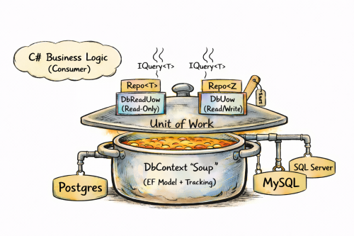

# EfCore.Boost  
A disciplined **Unit of Work + Repository + Routine + Model Building** layer for Entity Framework Core that makes database access **structured**, **portable**, and **powerful** across **SQL Server**, **PostgreSQL**, and **MySQL**.

EfCore.Boost is designed for systems that require any of the following:

- structured database access boundaries  
- predictable behavior across SQL Server, PostgreSQL, and MySQL  
- safe and powerful OData  
- high-performance bulk ingestion  
- first-class handling of views and routines  
- consistent transactional semantics  
- architecture that remains maintainable as systems grow  

EF Core remains the ORM.  
EfBoost strengthens how EF is used in real applications.

---

## 🎯 Why EfBoost Exists

Real enterprise systems hit problems plain DbContext usage does not solve elegantly:

| Real-world Problem | EfBoost Contribution |
|--------------------|---------------------|
| Everyone touches DbContext directly → chaos | Strong **Unit of Work** boundary |
| SQL Server here, PostgreSQL there… everything behaves differently | **Cross-provider conventions + helpers** |
| Stored routines, views, hierarchies, structured metadata | First-class **Routine Execution Model** |
| Exposing OData queries safely | Built-in **OData support** |
| Need to insert/delete a *lot* of data | **Bulk capabilities** |
| Need to run on different DB engines without rewriting everything | **Portable Model Building Conventions** |

---

## 🧠 Core Concepts

EfBoost introduces a **structured data access architecture**:

### ✔ Unit of Work
A UOW is the controlled gateway:

- Defines what is accessible  
- Manages lifecycle and transactions  
- Is aware of provider differences  
- Exposes repositories + routines safely  

Your app **does not talk to DbContext**.  
It talks to your UOW.  
That makes everything saner.  
[See more details here](./src/EfCoreBoost/UOW/DbUow.md).

---

### ✔ Repository Layer
Repositories provide pleasant clarity:

- Tracked vs no-tracking access  
- OData shaping support  
- Provider-safe metadata  
- Raw helpers  
- Bulk operations  

Perfect for tables and views.  
[See more details here](./src/EfCoreBoost/DbRepo/DbRepo.md).

---

### ✔ Routines (Procedures / Functions)
EfBoost treats database intelligence as a first-class citizen:

- Scalar routines  
- Tabular routines mapped to EF models  
- Cross-database safe patterns  
- Same C# call pattern regardless of provider  

[See more details here](./src/EfCoreBoost/UOW/DbUowRoutines.md).

---

### Architectural view



Think of the dababase model (`DbContext`) as a pot of soup.

Now we place a lid on the pot.  
In that lid we cut windows and each window represents a **Unit of Work**.  
A `DbUow` or `DbReadUow` provides controlled and focused access to the `DbContext` through its repositories, to tables and views in the databse.

Each UOW:

- Exposes only the repositories it defines  
- Controls tracking behavior  
- Controls saving and transaction boundaries  
- Handles communication with different database providers

The business logic interacts with repositories via `IQuery<T>` and save operations, never with the soup directly.  
It receives exactly what it needs. No more, no less.  
It also does not need to care whether the heat beneath the pot comes from SQL Server, MySQL, or Postgres.

> While the illustration shows clean boundaries, the repositories themselves are far from simple.  
> They support high-performance bulk operations and rich OData-based querying out of the box.  
> The diagram also does not show that each UOW owns its own `DbContext` instance and can even replace the context when needed.

---

## 🌍 Model Building & Cross-Platform Conventions  

EfBoost solves, **once and uniformly**, the practical differences between database engines.

Instead of scattering provider-specific rules throughout your codebase, EfBoost establishes a **single, consistent model-building and execution contract** that works across SQL Server, PostgreSQL, and MySQL.

This covers both:

- **how models are mapped**
- **how data is written and read safely**

EfBoost provides:

- Provider-safe **model-building conventions**
- **Intent-driven attributes** instead of fragile tuning
- Handles normalizing **naming, quoting, schemas, and identity**
- Uniform calling patterns for **views and routines**

Instead of hand-tuning models per database flavor, you do this once:

```csharp
protected override void OnModelCreating(ModelBuilder modelBuilder)
{
    modelBuilder.ApplyEfBoostConventions(this, "log"); 
    OnModelData(modelBuilder);
}
```
> *(In the example above, "log" is the default database-schema for your models)*

From there:

- Object names are mapped uniformly  
- Provider-specific quoting and casing are handled automatically  
- Routines are invoked consistently across databases  
- On **save**, EfBoost corrects common provider quirks such as:
  - invalid or overflowing string lengths
  - date and timestamp inconsistencies

Your model expresses **intent**.  
EfBoost applies **provider-correct behavior**.

The result is a model that stays **portable, predictable, and stable** as databases change. 

---

### 💡 Why this matters even if you’re single-provider today

Maybe your app starts small on PostgreSQL because it is simple and cost‑effective.  
Maybe later the business grows.  
Maybe suddenly the CTO waves a glittering Azure Enterprise plan in your face.

If your EF model was built “raw by hand”, you are potentially stuck.

If it was built with EfBoost conventions, the conversation changes:

- ✔ “We can migrate”  
- ✔ “We don’t have to rewrite schema mapping”  
- ✔ “We can keep our UOW & Repos”  
- ✔ “We don’t have to redesign core data architecture”  

EfBoost makes **start here, grow there** realistic instead of terrifying.

A detailed guide lives in [ModelBuilding.md](./src/EfCoreBoost/Model/ModelBuilding.md) explaining:

- How conventions work  
- What attributes do  
- Provider trade-offs  
- Practical guidance & strategy  

**Your C# code stays unaware of database quirks.**

EfBoost absorbs provider differences so your application logic remains clean and unchanged.

Database-specific behavior is handled once, centrally, instead of leaking into your codebase.

---

## 🚀 Quick Start

### Install
```bash
dotnet add package EfCore.Boost
```

### Define a Unit of Work
```csharp
public partial class UOWLogs(IConfiguration cfg) : UowFactory<DbLogs>(cfg, "Logs")
{
    public IAsyncRepo<LoginLog> LoginLogs => new EfRepo<LoginLog>(Ctx!, DbType);
    public IAsyncRepo<SessionLog> SessionLogs => new EfRepo<SessionLog>(Ctx!, DbType);
}
```

### Query with tracking
```csharp
var recent = await uow.LoginLogs.Query().OrderByDescending(x => x.CreatedUtc).Take(20).ToListAsync();
recent[0].Message = "Updated";
await uow.SaveChangesAsync();
```

### Query without tracking
```csharp
var sessions = await uow.SessionLogs.QueryNoTrack().Where(x => x.UserId == userId).ToListAsync();
```

### Run a routine
```csharp
var items = await uow.RunRoutineQuery<MyViewResult>("cms", "GetCurrentMenuItems", [new("@SessionId", sessionId)]).ToListAsync();
```

---

# FAQ

### Do we still use EF Core?
Yes. EfBoost sits above EF Core. EF remains your ORM.

---

### Do we still write LINQ?
Yes. Repositories expose IQueryable. Nothing exotic required.

---

### Is this only useful if I use multiple database providers?
No. Single-provider systems benefit from structure, safe OData usage, bulk performance, and clearer architectural boundaries.

---

### Does EfBoost remove the ability to access DbContext?
**Yes. Intentionally.**  
DbContext still exists under the hood and EfCore.Boost builds and configures it.
But it is not exposed for direct use.
All data access should instead go through the Unit of Work:
- DbUow for read-write operations
- DbReadUow for read-only operations  

This keeps boundaries explicit and intent clear.

---

### Does this replace migrations?
No. EF migrations still apply normally. EfBoost adds helpers but does not take ownership of migrations.  
See [this document](./src/EfCoreBoost/Model/EfMigrationsCMD.md) on how to apply migrations to multiple providers for the same model.

---

### Can I switch to another database provider without redeploying?
Yes. You can switch to another supported database engine **without recompiling or redeploying** your .NET application.  
Just update the database definition in your application configuration (`appsettings.json`).  
All required EF Core provider packages are shipped with the deployment.  
Your .NET code remains unchanged — only configuration changes.

---

### What happens when we scale teams and the system grows?
EfBoost keeps data access disciplined, defined, and maintainable — instead of evolving into loosely organized DbContext usage everywhere.  
By supporting multiple providers, you can also move from a low‑cost database setup to enterprise environments such as Azure with relative ease.

---

### How can EfBoost work uniformly across databases with different SQL and column types?
EfBoost builds on EF Core’s model-first approach. Schemas are generated from the C# model, and EfBoost applies provider-specific conventions to select appropriate column types and behavior.  
Views and routines are implemented by you (or your DB admin) per database, but invoked uniformly, as long as naming conventions are followed and OUT / INOUT parameters are avoided.  
EfBoost is intended to help you build and use your database in a portable way, not to expose every feature of every database.

---

# Summary

EfCore.Boost is for systems that require things like:

- structured database access  
- predictable cross-provider behavior  
- safe and capable OData  
- serious bulk ingestion performance  
- first-class support for views and routines  
- transactional discipline  
- long-term maintainability  

EF Core remains the ORM.  
EfCore.Boost helps turn it into a **robust, scalable, and well-structured data layer**.  
EfCore.Boost is ultimately about comfort and predictability.

By guiding entity access through clear entry points, everyday operations stop feeling improvised. Transaction boundaries are explicit, bulk operations integrate naturally, and common patterns remain consistent across the codebase.

Model construction becomes more direct as well. Intent is expressed on the model itself through focused attributes, reducing reliance on large and fragile fluent configuration blocks. The result is a model that is easier to read, easier to reason about, and easier to maintain over time.

---

## 📚 Further Reading
- [DbRepo.md](./src/EfCoreBoost/DbRepo/DbRepo.md) – Repositories, OData, raw SQL, bulk  
- [DbUOW.md](./src/EfCoreBoost/UOW/DbUow.md)  – Lifecycle, provider awareness, transaction control  
- [DbUowRoutines.md](./src/EfCoreBoost/UOW/DbUowRoutines.md)  – Portable routine strategies (Stored Procedures/Functions)  
- [ModelBuilding.md](./src/EfCoreBoost/Model/ModelBuilding.md) – conventions, attributes, portability  
- [EfMIgrationsCMD.md](./src/EfCoreBoost/Model/EfMigrationsCMD.md) – migrations for multiple providers  
- [BulkInserts.md](./src/EfCoreBoost/DbRepo/BulkInsert/BulkInserts.md) – bulk inserts  
- [OData.md](./src/EfCoreBoost/DbRepo/OData/OData.md) – OData helpers  
- [Configs.md](./src/EfCoreBoost/CFG/Configs.md) – Connection configuration
- [Testing](./tests/BoostTest/Readme.md) – Testing & examples including [test containers](./tests/BoostTest/TestContainers.md), [the Azure test](./tests/BoostTest/TestAzure.md), the [test database](./tests/BoostTest/TheTestDb.md) and the [smoke test](./tests/BoostTest/SmokeTest.md).
 
---

## 🏷 License
MIT.

---

## 🧭 Status
Actively developed.  
Project and solution templates coming soon.  
Documentation and examples expanding continuously.  
Oracle provider support under consideration.  