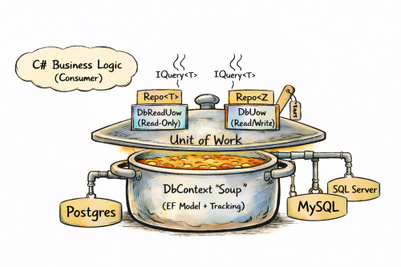

# EfCore.Boost  
EfCore.Boost is a provider-aware **Unit of Work and repository-style layer** built on top of Entity Framework Core.

It makes database access more **structured**, **portable**, and **predictable** across SQL Server, PostgreSQL, and MySQL.  
It extends EF Core with:
- structured migration workflows across multiple database providers
- utilities for bulk operations and routines
- OData integration support
- conventions that reduce boilerplate and enforce consistency

It does not replace EF Core — it standardizes how EF Core is used in real-world systems.

---

## 🎯 Why EfCore.Boost Exists
Application code should ideally not need to care whether the underlying database is SQL Server, PostgreSQL, or MySQL.  
At the same time, a raw `DbContext` often exposes a much larger surface area than most application modules should access directly.

EfCore.Boost builds on top of Entity Framework Core by adding a disciplined Unit of Work, Repository, and Model Building layer for structured database development across SQL Server, PostgreSQL, and MySQL.

Multiple targeted Unit of Work layers can be built on top of the same `DbContext`, allowing different parts of an application to expose only the repositories, routines, and access patterns they actually require.

The goal is to keep application architecture and data-access patterns consistent across supported relational database providers while exposing controlled and predictable database access.

The table below highlights common architectural and operational challenges in EF Core-based systems and the corresponding approach taken by EfCore.Boost.


| #                         | Area                                       | Typical EF Core Challenge                                      | EfCore.Boost Approach                                                     |
|---------------------------|--------------------------------------------|----------------------------------------------------------------|----------------------------------------------------------------------------|
| 1 | Data Access Boundaries | Direct DbContext usage can expose too much of the database surface area across an application. | [EfCore.Boost allows applications to expose only the repositories, entities, routines, and operations intended for each part of the system.](./docs/WhyBoost.md#link-1)                   |
| 2   | Multi-Provider | Behavior differs across SQL Server, PostgreSQL, and MySQL | [Provider-aware conventions and consistent mappings](./docs/WhyBoost.md#link-2)                         |
| 3   | Migrations | Managing migrations across environments and providers is fragile | [Controlled and streamlined migration workflows with script generation](./docs/WhyBoost.md#link-3)      |
| 4   | Bulk Operations | High-volume inserts and updates require custom solutions | [Built-in patterns for efficient bulk handling](./docs/WhyBoost.md#link-4)                              |
| 5   | OData | Query exposure can become unsafe or inconsistent | [Controlled and predictable OData integration](./docs/WhyBoost.md#link-5)                               |
| 6   | Database Features | Views, routines, and raw SQL are awkward to integrate cleanly | [First-class support for database-native constructs](./docs/WhyBoost.md#link-6)                         |
| 7   | Transactions | Complex transactions require manual coordination across EF operations, bulk work, routines, retries, and provider differences. | [Structured Unit of Work transactions with coordinated execution, rollback safety, and retry-aware handling.](./docs/WhyBoost.md#link-7)                         |
| 8   | Maintainability | Different parts of the system use different data access patterns | [Enforced conventions and predictable structure](./docs/WhyBoost.md#link-8)                             |
| 9   | Model Definition | Fluent configuration becomes complex and fragmented | [Attribute-driven conventions simplify and clarify model definitions](./docs/WhyBoost.md#link-9)        |


*Click on the approaches above for more details.*

---

## 🧩 What you get with EfCore.Boost

EfCore.Boost makes EF Core easier to use in systems where the database is central.

In practice, this means:

- **the same application code works across SQL Server, PostgreSQL, and MySQL**
- model definitions are simpler and easier to read, with less reliance on fluent configuration
- migrations and data seeding follow a structured, ready-to-run workflow
- bulk operations, routines, and OData are part of everyday data access
- application code interacts with a controlled and predictable data layer

---

## 🚫 When not to use EfCore.Boost

EfCore.Boost may be unnecessary if:

- your application is small and uses a single database
- your data access needs are simple and unlikely to grow
- you are comfortable managing EF Core behavior without an additional structure
- you do not require cross-provider support or advanced database features

---

## 🧠 Core Concepts

EfCore.Boost introduces a **structured data access architecture**:

### ✔ Unit of Work
A UOW is the controlled gateway. It builds on top of DbContext and acts as the application’s entry point to the data layer:

- defines what is accessible
- controls lifecycle and transaction boundaries
- applies provider-aware behavior
- exposes repositories and routines in a structured way

DbContext represents the underlying database model.  
The Unit of Work defines how it is accessed and extends it with additional capabilities.  
[See more details here](./docs/DbUow.md).

---

### ✔ Repository Layer
Repositories are built around the underlying DbSet for each entity or view, and provide a structured and extended way to interact with it.

They combine familiar querying with additional capabilities:

- clear separation between tracked and no-tracking access
- integrated OData query support
- provider-aware metadata and conventions
- helper methods for common data access patterns
- built-in bulk operations

In practice, they act as a structured and extended form of DbSet, making data access more consistent and easier to reason about.

Repositories work naturally with both tables and views.  
[See more details here](./docs/DbRepo.md).

---

### ✔ Routines (Procedures / Functions)
EfCore.Boost treats database intelligence as a first-class citizen:

- Scalar routines
- Tabular routines mapped to EF models
- Cross-database safe patterns
- Same C# call pattern regardless of provider

[See more details here](./docs/DbUowRoutines.md).

---

### 🏗️ Architectural view



Think of the dababase model (`DbContext`) as a pot of soup.

Now we place a lid on the pot.  
In that lid we cut windows and each window represents a **Unit of Work**.  
A `DbUow` or `DbReadUow` provides controlled and focused access to the `DbContext` through its repositories, to tables and views in the databse.

Each UOW:

- Exposes only the repositories it defines
- Controls tracking behavior
- Controls saving and transaction boundaries
- Handles communication with different database providers

The business logic interacts with repositories via `IQuery<T>` and save operations, never with the soup directly.  
It receives exactly what it needs. No more, no less.  
It also does not need to care whether the heat beneath the pot comes from SQL Server, MySQL, or Postgres.

> While the illustration shows clean boundaries, the repositories themselves are far from simple.  
> They support high-performance bulk operations and rich OData-based querying out of the box.  
> The diagram also does not show that each UOW owns its own `DbContext` instance and can even replace the context when needed.

---

## 🌍 Model Building & Cross-Platform Conventions

EfCore.Boost solves, **once and uniformly**, the practical differences between database engines.

Instead of scattering provider-specific rules throughout your codebase, EfCore.Boost establishes a **single, consistent model-building and execution contract** that works across SQL Server, PostgreSQL, and MySQL.

This covers both:

- **how models are mapped**
- **how data is written and read safely**

EfCore.Boost provides:

- Provider-safe **model-building conventions**
- **Intent-driven attributes** instead of fragile tuning
- Handles normalizing **naming, quoting, schemas, and identity**
- Uniform calling patterns for **views and routines**

Instead of hand-tuning models per database flavor, you do this once:

```csharp
protected override void OnModelCreating(ModelBuilder modelBuilder)
{
    base.OnModelCreating(modelBuilder);
    modelBuilder.ApplyEfBoostConventions(this, "log"); 
}
```
> *(In the example above, "log" is the default database-schema for your models)*

From there:

- Object names are mapped uniformly
- Provider-specific quoting and casing are handled automatically
- Routines are invoked consistently across databases
- On **save**, EfCore.Boost corrects common provider quirks such as:
    - invalid or overflowing string lengths
    - date and timestamp inconsistencies by encouraging UTC storage using `DateTime`

Your model expresses **intent**.  
EfCore.Boost applies **provider-correct behavior**.

The result is a model that stays **portable, predictable, and stable** as databases change.

---

### 💡 Why this matters even if you’re single-provider today

Maybe your app starts small on PostgreSQL because it is simple and cost‑effective.  
Maybe later the business grows.  
Maybe suddenly the CTO waves a glittering Azure Enterprise plan in your face.

If your EF model was built “raw by hand”, you are potentially stuck.

If it was built with EfCore.Boost conventions, the conversation changes:

- ✔ “We can migrate”
- ✔ “We don’t have to rewrite schema mapping”
- ✔ “We can keep our UOW & Repos”
- ✔ “We don’t have to redesign core data architecture”

EfCore.Boost makes **start here, grow there** realistic instead of terrifying.

A detailed guide lives in [ModelBuilding.md](./docs/ModelBuilding.md) explaining:

- How conventions work
- What attributes do
- Provider trade-offs
- Practical guidance & strategy

**Your C# code stays unaware of database quirks.**

EfCore.Boost absorbs provider differences so your application logic remains clean and unchanged.

Database-specific behavior is handled once, centrally, instead of leaking into your codebase.

---
## 🧾 Package Versions / Target Frameworks

EfCore.Boost is released in parallel package lines for different .NET / EF Core generations:

| Package Version | Target Framework | EF Core Version | Notes                                                       |
|-----------------|------------------|-----------------|-------------------------------------------------------------|
| 8.x             | .NET 8           | EF Core 8       | Stable package line for .NET 8 projects                     |
| 9.x             | .NET 9           | EF Core 9       | Package line for .NET 9 projects                            |
| 10.x            | .NET 10          | EF Core 10      | Package line for .NET 10 projects |

Choose the package version that matches your target framework and EF Core version.

Example:

```bash
dotnet add package EfCore.Boost --version 8.0.4
or
dotnet add package EfCore.Boost --version 9.0.4
or
dotnet add package EfCore.Boost --version 10.0.4
```

---

## 🚀 Quick Start

### Start with a Template (Recommended)

The easiest way to get started with EfCore.Boost is to use the solution template:

```bash
dotnet new install EfCore.Boost.Template.Simple.Solution@8.0.4
dotnet new boostsimplesolution -n YourProjectName
```
for .net 8 projects, or replace with @9.0.4 or @10.0.4 for .net 9 or 10 projects.

Specify **--Schema** or **--Context** f you want to customize the default schema name or your db context name.

This generates a ready-to-use solution with:
- A **Model project** containing your DbContext, entities, and Unit of Work
- A **Migrate project** for managing migrations, and seed data
- A **Test project** pre-configured for integration testing with TestContainers
- A **Web-Api project** demonstrating dependency injection with the UoW-Factory and OData interface

### Quick Start Guide
For a step-by-step walkthrough of creating and developing your first EfCore.Boost project, check out our walkthrough guide:
→ [**Getting Started: MyPets Walkthrough**](./docs/GettingStarted.md)

## Manual Integration
If you prefer not to start from a template, you can integrate **EfCore.Boost** into an existing project.

A detailed guide on manual integration is available here:
→ [Manual Installation & Integration](./docs/manual.md)

---

# 💬 FAQ

### Do we still use EF Core?
Yes. EfCore.Boost sits above EF Core. EF remains your ORM.

---

### Do we still write LINQ?
Yes. Repositories expose `IQueryable`, so you write standard LINQ. EfCore.Boost requires every query to explicitly declare whether it is tracked or untracked by starting with either `QueryTracked()` or `QueryUnTracked()`. This eliminates accidental tracking caused by EF Core's default tracking behavior.

**Standard EF Core:**
```csharp
var exchRow = await myContext.CurrencyRates
    .AsNoTracking()
    .Where(cc => cc.Code == res.Currency && cc.StartDate <= endDate)
    .OrderByDescending(cc => cc.StartDate)
    .FirstOrDefaultAsync(ct);
```

**With EfCore.Boost:**
```csharp
var exchRow = await myUow.CurrencyRates
    .QueryUnTracked()
    .Where(cc => cc.Code == res.Currency && cc.StartDate <= endDate)
    .OrderByDescending(cc => cc.StartDate)
    .FirstOrDefaultAsync(ct);
```
Apart from explicitly choosing tracked or untracked queries, the LINQ syntax is almost identical because `QueryTracked()` and `QueryUnTracked()` return an `IQueryable`.

---

### Is this only useful if I use multiple database providers?
No. Single-provider systems benefit from structure, safe OData usage, bulk performance, and clearer architectural boundaries.

---

### Does EfCore.Boost remove the ability to access DbContext?
EfCore.Boost shapes and configures the DbContext and uses it internally, but it is not exposed through the Unit of Work.  
All normal data access should go through:
- **DbUow** for read-write operations
- **DbReadUow** for read-only operations

You can still access *DbContext* by other means if needed, but there should be no practical reason to do so.

---

### Does this replace migrations?
No. EF migrations still apply normally. EfCore.Boost adds helpers but does not take ownership of migrations.  
See [this document](./docs/EfMigrationsCMD.md) on how to apply migrations to multiple providers for the same model.

---

### Can I switch to another database provider without redeploying?
Yes. You can switch to another supported database engine **without recompiling or redeploying** your .NET application.  
Just update the database definition in your application configuration (`appsettings.json`).  
All required EF Core provider packages are shipped with the deployment.  
Your .NET code remains unchanged — only configuration changes.

---

### What happens when we scale teams and the system grows?
EfCore.Boost keeps data access disciplined, defined, and maintainable — instead of evolving into loosely organized DbContext usage everywhere.  
By supporting multiple providers, you can also move from a low‑cost database setup to enterprise environments such as Azure with relative ease.

---

### How can EfCore.Boost work uniformly across databases with different SQL and column types?
EfCore.Boost builds on EF Core’s model-first approach. Schemas are generated from the C# model, and EfCore.Boost applies provider-specific conventions to select appropriate column types and behavior.  
Views and routines are implemented by you (or your DB admin) per database, but invoked uniformly, as long as naming conventions are followed and OUT / INOUT parameters are avoided.  
EfCore.Boost is intended to help you build and use your database in a portable way, not to expose every feature of every database.

---

# 📌 Summary

EfCore.Boost is for systems that require things like:

- structured database access
- predictable cross-provider behavior
- safe and capable OData
- serious bulk ingestion performance
- first-class support for views and routines
- transactional discipline
- long-term maintainability

EF Core remains the ORM.  
EfCore.Boost helps turn it into a **robust, scalable, and well-structured data layer**.  
EfCore.Boost is ultimately about comfort and predictability.

By guiding entity access through clear entry points, everyday operations stop feeling improvised. Transaction boundaries are explicit, bulk operations integrate naturally, and common patterns remain consistent across the codebase.

Model construction becomes more direct as well. Intent is expressed on the model itself through focused attributes, reducing reliance on large and fragile fluent configuration blocks. The result is a model that is easier to read, easier to reason about, and easier to maintain over time.

---

## 📚 Further Reading
[Detaild documentation](./docs/readme.md) is found under the document folder (docs).
 
---
## 🏷 License
MIT.

---

## 🧭 Status
Actively developed.  
Project and solution templates are available (see Quick Start).  
More templates and variations are coming soon.  
Documentation and examples expanding continuously.  
Oracle provider support is under consideration.  