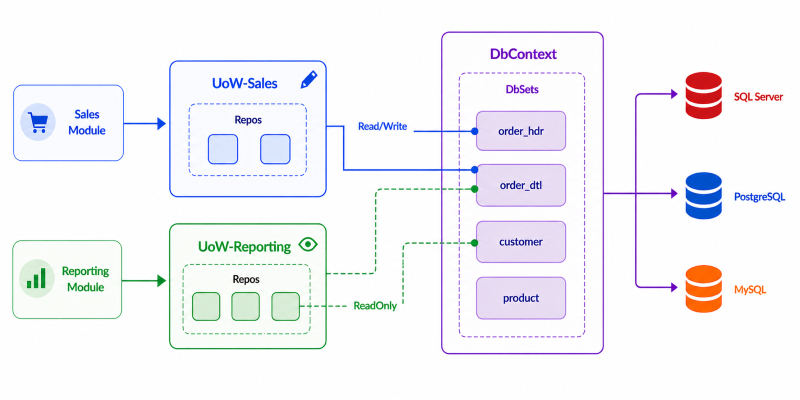

# DbUOW.md  
## Database Unit of Work (Uow)

`DbUow<TContext>` is the foundational **Unit of Work** abstraction in EfCore.Boost.  
It defines a controlled, structured, and powerful gateway between your .NET application and the database.

Instead of working directly with raw Entity Framework DbContexts, EfCore.Boost introduces a **layered, structured access model**:
- Applications do **not** talk directly to DbContext
- Applications talk to a **DbUOW**
- The UOW decides
  - what parts of the database are available
  - what is readable or writable
  - what must stay protected
- Actual table / entity access happens through **Repository classes** (see: [DbRepo.md](./DbRepo.md))
- Specialized and high‑performance database logic flows through **Routines** (see: [DbUowRoutines.md](./DbUowRoutines.md))

This gives clarity, safety, better architecture boundaries, and powerful features beyond normal EF.

Put simply:

> **This is the controlled entry point between your .NET application and the database.  
> Everything meaningful passes through a UOW.**



*Relationship between targeted UoWs, boosted repositories, the shared `DbContext`, and its underlying `DbSet<T>` entries.*

---

## Purpose

A UOW exists to:

- Represent a single logical database session  
- Define *what* parts of the database are accessible by Exposing repositories and routine helpers
- Control whether things are:
  - Read-only  
  - Read/Write  
  - Or not exposed at all  
- Provide convenient helpers where EF alone is not ideal  
- Coordinating SaveChanges and transactions
- Enable advanced scenarios through routines  
- Provider-agnostic behavior (SQL Server, PostgreSQL, MySQL)
- Safe retry semantics for cloud databases

UOW is not just plumbing.  
It is the **guardian, rulebook, and control center** for database communication.

---

## Sync vs Async API

The DbUOW exposes both synchronous and asynchronous APIs.

Naming conventions:

- Async methods end with `Async`
- Synchronous methods end with `Synchronized`

Example:

```csharp
await uow.SaveChangesAsync(ct);
uow.SaveChangesSynchronized();
```

Guideline:

- Prefer async APIs in WebAPI, background services, and I/O-bound workflows
- Synchronous APIs exist for legacy, tooling, and batch scenarios

Naming convention:

| Pattern | Meaning |
|--------|--------|
| `Async` methods | Non-blocking async |
| `Syncronized` suffix | Explicit synchronous variant |

---

### Key Characteristics

- Constructor receives:
  - `IConfiguration`
  - Logical connection name
- The factory takes care of:
  - Provider handling (SQL Server / PostgreSQL / MySQL)
  - Handle connections including Azure and Managed Identity behavior
- Keeps configuration responsibility centralized and safe

Your application simply requests a UOW, and the right database connection is in play.

---

## Provider Awareness

A UOW is transparently aware of which database engine is being used.

Supported engines:

- SQL Server  
- PostgreSQL  
- MySQL  

The UOW ensures higher-level APIs stay consistent even when individual engines differ under the hood.

---

## DbUow & DbReadUow

EfCore.Boost provides two distinct Unit of Work types:

- `DbUow` – Read/Write  
- `DbReadUow` – Read-Only  

The separation is intentional and architectural.

### DbUow

`DbUow` is used when data modifications are required.

It:

- Allows tracking
- Allows saving operations
- Defines transaction boundaries
- Can expose both read/write and read-only repositories

A `DbUow` may include read-only repositories when practical,  
but it always has the capability to perform writes.

Use this when your operation changes state.

### DbReadUow

`DbReadUow` is designed strictly for query scenarios.

It:

- Does not allow save operations
- Restricts write-side behavior
- Guards against unintended side effects
- Exposes only read-only repositories

It would not be practical to include write-capable repositories in a read-only UOW, as that would defeat its purpose.  

If a service depends on `DbReadUow`, it is explicitly stating:

> This operation does not modify data.

By separating read and write UOWs, EfCore.Boost makes intent visible in the type system.  
Side effects are no longer accidental.  


---

## Saving & Lifecycle

### Standard Commit
Normal persistence:

```csharp
await SaveChangesAsync();
```

### Resetting Commit
For large workloads, bulk operations, or very long running contexts:

```csharp
await SaveChangesAndNewAsync();
```

This allows you to continue working without DbContext tracking buildup.

The UOW follows predictable disposal semantics, ensuring connections are properly closed.

> Note:
> `SaveChangesAndNewAsync()` and `SaveChangesAndNewSynchronized()`
> cannot be used while a transaction is active on the UOW instance.

---

## Transactions

The UOW provides a **transaction envelope** rather than exposing raw transaction handles.

This design:

- Uses EF Core execution strategies (retry-safe, Azure-friendly)
- Ensures consistent commit / rollback behavior
- Prevents accidental nested transactions on the same UOW instance

### Async transaction envelope (recommended)

```csharp
await uow.RunInTransactionAsync(async ct =>
{
    // repository and routine calls
    await uow.SaveChangesAsync(ct);
}, IsolationLevel.ReadCommitted, ct);
```

### Synchronized transaction envelope

```csharp
uow.RunInTransactionSynchronized(() =>
{
    // repository and routine calls
    uow.SaveChangesSynchronized();
}, IsolationLevel.ReadCommitted);
```

Behavior:

- Only one active transaction is allowed per UOW instance
- If an exception escapes the work delegate, the transaction is rolled back
- On success, the transaction is committed automatically

---

## Nested Work and Bulk Operations

Repositories and bulk operations automatically adapt to the transaction context:

- If a transaction is already active on the DbContext, operations participate in it
- Otherwise, operations may create an internal transaction as needed

This allows patterns such as:

```csharp
await uow.RunInTransactionAsync(async ct =>
{
    await uow.LogEntries.BulkInsertAsync(items, ct: ct);
    await uow.SaveChangesAsync(ct);
}, ct: ct);
```

---

## Repository Access

Repositories are the primary way to work with tables and views.

A UOW exposes repository instances such as:

```csharp
public IAsyncRepo<LoginLog> LoginLogs => new EfRepo<LoginLog>(Ctx!, DbType);
```

Repositories bring significant power:

- Clean query API  
- Optional strongly-typed constraints  
- Dictionary-style access patterns  
- Built-in conventions  

And importantly:

- **OData query shaping support**  
- **Bulk insert support**  

A separate document dives deeper into repo powers:

📄 [DbRepo.md](./DbRepo.md) **– Repository Capabilities, OData & Bulk Operations**

The philosophy is:

> Application code talks to repositories.  
> UOW decides which repositories exist and how they behave.  
> DbContext stays behind the curtain.

---

## Routines: Beyond Plain Table Access

UOW also provides structured access to routines (procedures + functions).

Why routines?

- Highly optimized lookups  
- Hierarchical data evaluation  
- Encapsulated logic  
- Better performance than huge LINQ expressions  
- Efficient sequence usage  
- Engine-native execution paths  

UOW offers scalar, tabular, and non-query routine helpers and keeps them cross-platform safe.

See details here:

📄 [DbUowRoutines.md](./DbUowRoutines.md) **– Routine Execution & Design Guidelines**

---

## Configuration

UOWs bind to named database configuration entries:

```json
"DBConnections": {
  "Logs": {
    "ConnectionString": "...",
    "UseAzure": false,
    "UseManagedIdentity": false,
    "AzureTenantId": "",
    "AzureClientId": "",
    "AzureClientSecret": ""
  }
}
```

Centralized. Secure. Consistent.   
See: [Configs.md](./Configs.md)

---

## Construction & Dependency Injection

A concrete UOW inherits from `UowFactory<TContext>`. It defines the
repositories and routines that make up the application's database API.

In most applications, UOWs are created through a small factory that
integrates with dependency injection.

The example below demonstrates the typical structure of a concrete UOW:

-   It derives from `UowFactory<DbLogs>`.
-   It exposes repositories through properties.
-   It exposes routines through typed helper methods.
-   It hides the underlying `DbContext` behind a controlled API.

### Example UOW class definition

``` csharp
public partial class UOWLogs(IConfiguration cfg) : UowFactory<DbLogs>(cfg, "Logs")
{
    public IAsyncRepo<LoginLog> LoginLogs => new EfRepo<LoginLog>(Ctx!, DbType);
    public IAsyncRepo<SessionLog> SessionLogs => new EfRepo<SessionLog>(Ctx!, DbType);

    // Example tabular routine exposure
    public IQueryable<MyViewData> GetMyViewData(long sessionId) =>
        RunRoutineQuery<MyViewData>("my", "GetMyViewData", [new("@SessionId", sessionId)]);
}
```

### Understanding the UOW class

The example above illustrates the typical structure of a concrete UOW.

A UOW derives from `UowFactory<TContext>`, which creates and manages the
underlying `DbContext` based on the configured connection.

The constructor specifies the logical connection name (`"Logs"`),
allowing EfCore.Boost to resolve the correct provider and connection
string from configuration.

Repositories are exposed as properties (`LoginLogs` and `SessionLogs`),
defining the tables and views that the application may access.

Likewise, database routines are wrapped in strongly typed methods
(`GetMyViewData`), giving the application a clean API without exposing
provider-specific details. In this example, `MyViewData` is mapped as a
typed model and returned through `RunRoutineQuery`, allowing the
application to consume the routine just like any other strongly typed
query.

In most applications, the UOW becomes the only public entry point to the
database.

### Creating UOW instances

A UOW can always be created directly:

``` csharp
using var uow = new UOWLogs(configuration);
```

This approach is perfectly suitable for:

-   Unit tests
-   Console applications
-   Small utilities
-   One-off scripts

For ASP.NET Core and other dependency-injection-based applications, a
factory is usually more convenient.

A common pattern is to include a small `UowFactory` implementation in
the model project:

``` csharp
public interface IUowLogsFactory
{
    UOWLogs Create(string? connectionName = null);
}

public sealed class UowLogsFactory(IConfiguration cfg) : IUowLogsFactory
{
    public UOWLogs Create(string? connectionName = null) =>
        new UOWLogs( cfg, string.IsNullOrWhiteSpace(connectionName) ? cfg["DefaultAppConnName"]! : connectionName);
}
```

The factory can now be injected wherever a UOW is needed.

For example, in `Program.cs`:

``` csharp
builder.Services.AddSingleton<IUowLogsFactory, UowLogsFactory>();
```

Because the factory only stores configuration, it is safe to register as
a singleton. Each call to `Create()` constructs a fresh UOW and
underlying `DbContext`.

A typical service can then create a UOW for each operation:

``` csharp
public sealed class LogService(IUowLogsFactory factory)
{
    public async Task<List<LoginLog>> GetRecentAsync()
    {
        using var uow = factory.Create();
        return await uow.LoginLogs.QueryUnTracked()
            .OrderByDescending(x => x.CreatedUtc)
            .Take(20).ToListAsync();
    }
}
```

Alternatively, if a service performs multiple operations against the
same database during its lifetime, the UOW can be created lazily and
reused within that service instance:

``` csharp
public sealed class LogService(IUowLogsFactory factory)
{
    private readonly IUowLogsFactory _factory = factory;
    private UOWLogs? _uowLogs;

    private UOWLogs Uow => _uowLogs ??= _factory.Create();

    // Member functions use Uow...
}
```

> **Note:** A UOW is not thread-safe because the underlying `DbContext`
> is not thread-safe. Do not share the same UOW instance across
> concurrent operations.

---

### Optional: Direct DbContext Access

By default, EfCore.Boost hides the underlying `DbContext`. This encourages all database access to flow through the repositories and routines exposed by the UOW.

For advanced scenarios where direct EF Core access is required, a concrete UOW can opt in by overriding `AllowDbContextAccess`:

```csharp
public partial class UOWLogs(IConfiguration cfg) : UowFactory<DbLogs>(cfg, "Logs")
{
    protected override bool AllowDbContextAccess => true;
}
```

The `DbContext` can then be obtained through:

```csharp
var db = await uow.GetDbContext();
```
Direct `DbContext` access should generally be reserved for advanced scenarios where the repository or routine API is not sufficient.

---

## About Model Building & Migrations

EfCore.Boost also includes helpers related to model building and migrations, supporting:

- Multi-provider alignment  
- Structure consistency  
- Improved developer workflow  

However, that belongs to a dedicated topic:📄 [ModelBuilding.md](./ModelBuilding.md)

---

## 📌 Summary

`DbUow` is:

- The controlled **gateway** to the database  
- The authority defining what data can be accessed  
- The foundation for Repository access  
- The bridge to extremely powerful routine execution  
- Transaction capable  
- Sync + Async capable  
- Provider aware  
- Ready for real-world workloads  

EfCore.Boost replaces “naked DbContext access” with a structured, layered, safer approach.  
And this class is the heart of that design.
