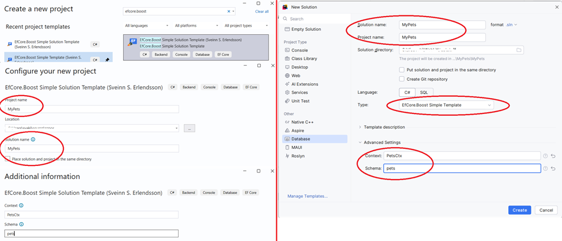

# Step 1: Downloading and Applying the Template

To get started with EfCore.Boost, the easiest way is to use one of the pre-configured solution templates. This ensures you have the correct project structure and dependencies from the start.

## 1.1 Download the Template

The templates are available as NuGet packages or directly from the source. For this guide, we will use the `Boost.Simple.Solution` template.

### Using the .NET CLI

You can install the templates using the following command:

```bash
dotnet new install EfCore.Boost.Template.Simple.Solution::9.0.1
```
There is also a version for .NET 8 and a pre-release version for .NET10

## 1.2 Create the MyPets Solution

Once the template is installed, you can create a new solution. We will name our solution `MyPets`.

### Using the CLI

Open your terminal and navigate to the folder where you want to create your project (MyPets), then run:

```bash
dotnet new boostsimplesolution -n MyPets
```

### Using JetBrains Rider

1. Open Rider and select **New Solution**.
2. Enter **Solution name**: `MyPets` & **Project name**: `MyPets`.
3. Select **Project type**: `Database`.
4. Locate the template **Type** in the dropdown 
5. Expand **Advanced Settings**
6. Enter Context: `PetsCtx` and Schema: `pets`.
7. Click **Create**.


### Using Visual Studio

1. Open Visual Studio and select **Create a new project**.
2. Search for **EfCore.Boost**.
3. Select the solution template and click **Next**.
4. Name the project `MyPets` and click **Next**
5. Enter Context name: `PetsCtx`, Schema: `pets` and click **Create**.



---

[Next: Project Structure >](Step2-ProjectStructure.md)
