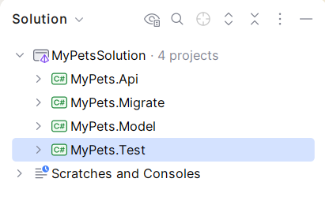

# Step 2: Project Structure Overview

After creating the `MyPets` solution, you will see several projects. Each has a specific responsibility in the EfCore.Boost architecture.

## 2.1 The Projects

### 1. MyPets.Model
This project contains the core data model. It is kept clean of operational baggage:
- **Entities**: Your domain models (classes).
- **DbContext**: The `MyPetsCtx` class where EF Core is configured.
- **Unit of Work (UoW)**: The `MyPetsUow` class, which serves as the primary API for your data layer.
- **Repositories**: Standardized repositories for data access.

### 2. MyPets.Migrate
A specialized tool for database lifecycle management:
- **Deployment & Seeding**: Handles the heavy lifting of database creation and importing large datasets (CSV/JSON), keeping the `Model` project lightweight.
- **Migration Scripts**: Contains the `Ps` folder with PowerShell scripts for managing migrations across SQL Server, PostgreSQL, and MySQL.

### 3. MyPets.Test
Focuses on ensuring your data layer works correctly across all supported platforms:
- **Cross-Platform Verification**: Uses **TestContainers** to run tests against real database engines (SQL Server, PG, MySQL).
- **SQL Object Mapping**: Verifies that manual SQL objects (like Views) are correctly mapped and functional.
- **Smoke Tests**: Validates the DbContext and UoW implementation.

### 4. MyPets.Api
A very lightweight API project that demonstrates:
- **Dependency Injection**: Shows how to inject the `IUowMyPetsFactory` and the Business Logic Layer (BLL).
- **Service Layering**: Includes a simple BLL and Controller to demonstrate a clean path for using the Unit of Work.
- **Pragmatic Example**: It serves as a minimal implementation to show how the data layer integrates with a web application.

## 2.2 Why This Structure?

The structure is designed for efficiency and operational reliability:
- **Clean Model**: The model project only contains what is needed for the application to run, without seed data or migration logic.
- **Deployment Isolation**: All database setup and data import tasks are isolated, making deployment and environment setup straightforward.
- **Reliable Testing**: By using test containers, we ensure that the specific SQL features (like views and provider-specific defaults) work exactly as expected on every provider.
- **Very Lightweight Entry Point**: The API project is intentionally kept simple to focus on demonstrating how to wire up the UoW factory and logic layers via dependency injection.

---

[Next: Modeling the Domain >](Step3-Modeling.md)
