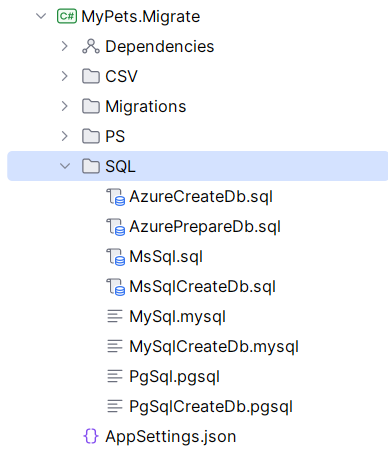

# Step 4: Creating Views

Often, you want to read data from multiple tables merged into a single "Read Model". EF Core supports database views, and EfCore.Boost makes working with them even more convenient.

The path of using views in an application can be extremely efficient (especially when combined with OData) and powerful for reporting—both for performance and for creating clean, read-only structures.

While creating a view for just these two entities may not be strictly practical for such a small and simple domain, we want to demonstrate how views are handled and how custom SQL can be shipped with your migrations.

In EfCore.Boost, we handle this by creating Database Views. We start by defining the view like any other entity, but the `ViewKey` attribute will register the entity as a read-only object and specify the necessary primary key for the view entity.

We will create a view called `PetDetails` that combines `Pet` data with the `AnimalType` name.

## 4.1 Define the View Model

In `MyPets.Model`, create a class for the view. Mark it with `[ViewKey]` to define its identity and ensure it's treated as read-only.

```csharp
[ViewKey(nameof(Id))]
public class PetDetails
{
    public int Id { get; set; }
    public string PetName { get; set; } = null!;
    public string AnimalTypeName { get; set; } = null!;
    public string? Breed { get; set; }
    public int BirthYear { get; set; }
}
```

## 4.2 Create the SQL Definition

Although the model for the view is defined in the `MyPets.Model` project, the actual SQL scripts we ship with the application go into the `SQL` folder in the `MyPets.Migrate` project.



This folder is used for customizing the create script for the database (for each provider) but it is also the place for any custom SQL scripts, like our view.

Views are defined in manual SQL files within the.
### SQL Server (`SQL/MsSql.sql`)
```sql
CREATE VIEW [pets].[PetDetails] AS
SELECT 
    p.Id, 
    p.Name AS PetName, 
    at.Name AS AnimalTypeName, 
    p.Breed,
    p.BirthYear
FROM [pets].[Pets] p
JOIN [pets].[AnimalTypes] at ON p.AnimalTypeId = at.Id
```

## 4.3 Multi-Provider Conversion

When moving to PostgreSQL or MySQL, the SQL syntax changes. You can use AI (like ChatGPT or Copilot) to help with the conversion.

### AI Prompt Example:
> "Convert this SQL Server VIEW to PostgreSQL. Ensure you wrap the schema, table, and column names in double quotes. The schema name is 'pets'."

### PostgreSQL (`SQL/PgSql.pgsql`)
```sql
CREATE VIEW "pets"."PetDetails" AS
SELECT 
    p."Id", 
    p."Name" AS "PetName", 
    at."Name" AS "AnimalTypeName", 
    p."Breed",
    p."BirthYear"
FROM "pets"."Pets" p
JOIN "pets"."AnimalTypes" at ON p."AnimalTypeId" = at."Id"
```

### MySQL (`SQL/MySql.mysql`)
For MySQL, EfCore.Boost maps the schema and table name by joining them with an underscore (e.g., `pets_PetDetails`). Avoid quoting object names unless necessary.

### AI Prompt Example:
> "Convert this SQL Server VIEW to MySQL. Do not quote object names. The schema 'pets' should be prefixed to table names with an underscore (e.g., pets_TableName)."

```sql
CREATE VIEW pets_PetDetails AS
SELECT 
    p.Id, 
    p.Name AS PetName, 
    at.Name AS AnimalTypeName, 
    p.Breed,
    p.BirthYear
FROM pets_Pets p
JOIN pets_AnimalTypes at ON p.AnimalTypeId = at.Id
```

## 4.4 Where do these files go?
The files should be placed in the `MyPets.Migrate` project:
- `SQL/MsSql.sql`
- `SQL/PgSql.pgsl`
- `SQL/MySql.mysql`

These scripts are automatically picked up by the migration process.

---

[Next: Running Migrations >](Step5-Migrations.md)
