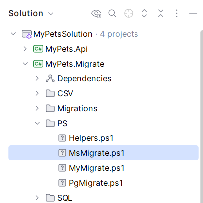

# Step 5: Running Migrations

Now that our model and views are defined, we need to generate the database schema. EfCore.Boost uses PowerShell scripts to manage this across multiple providers.

## 5.1 Database Configuration (`AppSettings.json`)

The migration process is driven by the configuration in `AppSettings.json` within the `MyPets.Migrate` project. This file defines your database connections and their respective providers.

```json
{
  "DefaultAppConnName": "PetsPg",
  "DBConnections": {
    "PetsMs": {
      "ConnectionString": "...",
      "Provider": "SqlServer"
    },
    "PetsPg": {
      "ConnectionString": "...",
      "Provider": "Postgres"
    },
    "PetsMy": {
      "ConnectionString": "...",
      "Provider": "MySql"
    }
  }
}
```

- **Connection by Name**: Each migration script is linked to a connection by its name (e.g., `PetsMs`).
- **Provider Definition**: The `Provider` property in the configuration tells EfCore.Boost which database engine to target.
- **Offline Generation**: When you build or generate a migration, EfCore.Boost does **not** connect to the actual database. The connection is only established when the deployment is executed.

Our template comes pre-configured with these three connection strings for PostgreSQL, MySQL, and MsSql.

## 5.2 The Ps Folder

Navigate to the `MyPets.Migrate` project and find the `Ps` folder. This contains the PowerShell scripts used to manage migrations.



## 5.3 Generating Initial Migrations

Run the script for the provider(s) you want to use. You only run the migrations you need, of course. These scripts will:
1. Delete any existing migrations (for a fresh start).
2. Generate a new EF Core migration.
3. Bundle the manual SQL (like your Views) into a deployment script.

### For SQL Server:
```powershell
./MsMigrate.ps1
```

### For PostgreSQL:
```powershell
./PgMigrate.ps1
```

### For MySQL:
```powershell
./MyMigrate.ps1
```

## 5.4 Deployment Scripts

When you run a script, you will see output in the terminal showing the EF Core commands being executed.

The migrations will produce a SQL script for the migration, placed in the root of the `Migrations` folder in the `MyPets.Migrate` project, starting with `DbDeploy_`. You can ship those to your DB admin, but they will also be picked up by the Console migration (see [Step 8](Step8-Deployment.md)).

- `Migrations/DbDeploy_MsSQL.sql`
- `Migrations/DbDeploy_PgSQL.pgsql`
- `Migrations/DbDeploy_MySQL.mysql`

For more details on incremental migrations (adding changes later), see the [Migrate Project README](../../TemplateWork/Boost.Simple/BoostX.Migrate/README.md).

---

[Next: Seed Data >](Step6-SeedData.md)
